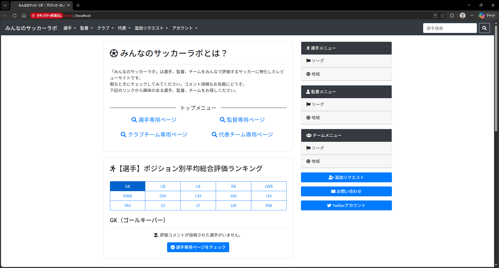

# ⚽ みんなのサッカーラボ - Archive



> **Note**: 本リポジトリは、かつて運営されていたWebサービス「みんなのサッカーラボ」（`https://football-labo.com/` ）のソースコード・アーカイブです。現在サービスは終了しています。

## 📖 プロジェクトについて

「みんなのサッカーラボ」は、プロサッカー選手・監督・クラブチーム・代表チームをみんなで評価する、サッカーに特化したレビューサイトでした（かつて https://football-labo.com/ にて運用されていましたが、現在はサービスを終了しています）。
本リポジトリは、ユーザーが気軽にレーティング（評価）とコメントを投稿し、共有できた同Webアプリケーションのソースコードアーカイブです。

**初めての個人開発プロジェクト**としてゼロから設計・開発を行い、インフラ構築（Docker/Nginx/Gunicorn）、バックエンド（Django）、フロントエンドの実装までを一貫して担当し、実際に本番運用を行いました。初めてのプロダクト開発であったため、コードの品質や設計に関して至らない点も多々あるかと思いますが、学習と実践の記録としてご容赦ください。

## ⚽ 主な機能

*   **選手・監督・チームのレビュー機能**
    *   **選手:** シュート、ドリブル、パス、守備力、フィジカル、スピード（GKはセービング、ハンドリングなど）を個別に評価。
    *   **監督:** 攻撃戦術、守備戦術、実績、マネジメント、育成、政治力などを評価。
    *   **チーム（クラブ・代表）:** 攻撃力、守備力、フロント/協会、育成などを評価。
*   **ランキング機能**
    *   各ポジション別や、全体での平均総合評価ランキングの表示。
*   **コミュニティ（SNS）機能**
    *   ユーザー登録、プロフィール設定、アイコン画像アップロード。
    *   気になるユーザーのフォロー / フォロワー機能と、タイムラインでのコメント閲覧。
    *   投稿されたコメントへの「いいね」機能（IPベースの連続いいね防止機能付き）。
*   **データベース拡張（リクエスト）機能**
    *   サイトに登録されていない選手、監督、クラブチーム、代表チームの新規追加リクエスト機能。
    *   既存データの更新リクエスト機能。
*   **Twitter連携（自動ツイート）**
    *   定期的に投稿されたレビューをピックアップし、公式Twitterアカウントへ自動でツイート（APSchedulerとTweepyを使用）。

## 🛠️ 技術スタック

*   **Backend:** Python 3.8, Django 3.2
*   **Database:** PostgreSQL 15.4
*   **Infrastructure / Server:** Docker, Docker Compose, Nginx, Gunicorn

## 🚀 ローカル環境のセットアップ（アーカイブ用）

過去の動作を確認するためのローカル環境構築手順です。

1. **リポジトリのクローン**
   ```bash
   git clone https://github.com/kkoch5t2/football-labo.git
   cd football-labo
   ```

2. **環境変数の準備**
   本リポジトリには機密情報を除外した `.env.example` および `.env.local.example` が含まれています。
   動作には `.env`（共通設定）と `.env.local`（ローカル環境用設定）の**両方**が必要です。それぞれコピーして作成してください。
   ```bash
   cp .env.example .env
   cp .env.local.example .env.local
   ```
   ※必要に応じて、環境変数（特に `POSTGRES_PASSWORD` やメール設定など）を編集してください。

3. **コンテナのビルドと起動**
   ```bash
   docker-compose -f docker-compose.local.yml build
   docker-compose -f docker-compose.local.yml up -d
   ```

4. **静的ファイルの収集**
   コンテナ起動後、CSSなどの静的ファイルをNginxが配信できるように収集（collectstatic）します。
   ```bash
   docker-compose -f docker-compose.local.yml exec web python manage.py collectstatic --noinput
   ```

5. **データベースのマイグレーションと初期設定**
   データベースにテーブルを作成します。（※本リポジトリはアーカイブ公開時にマイグレーション履歴を `0001_initial.py` に整理・Squashしています）
   ```bash
   docker-compose -f docker-compose.local.yml exec web python manage.py makemigrations soccer
   docker-compose -f docker-compose.local.yml exec web python manage.py migrate
   ```

6. **管理者アカウント（スーパーユーザー）の作成**
   初期化されたデータベースにはユーザーが存在しないため、以下のコマンドで管理者アカウントを作成・有効化します。
   ```bash
   # 例: ユーザー名「admin」、パスワード「admin」で作成する場合
   docker-compose -f docker-compose.local.yml exec -e DJANGO_SUPERUSER_PASSWORD=admin web python manage.py createsuperuser --noinput --username admin --email admin@example.com
   # ユーザーを有効化する（CustomUserの仕様により必須）
   docker-compose -f docker-compose.local.yml exec web python manage.py shell -c "from django.contrib.auth import get_user_model; User=get_user_model(); User.objects.filter(username='admin').update(is_active=True)"
   ```

7. **アクセス**
   ブラウザで以下のURLにアクセスしてください。
   * トップページ: `http://localhost:8080/` (または `http://localhost/`)
   * 管理画面: `http://localhost:8080/admin/`

## 📂 デプロイ環境

*   `docker-compose.local.yml`: ローカル開発環境用
*   `docker-compose.stg.yml`: ステージング環境用
*   `docker-compose.prod.yml`: 本番環境用

> [!NOTE]
> ステージング（`stg`）や本番（`prod`）環境を構築する場合は、環境に応じた設定ファイルが必要です。
> `.env.example` をコピーして、それぞれ `.env.stg` または `.env.prod` という名前で作成し、データベースのパスワードなどのパラメータをご自身の環境に合わせて設定してください。
